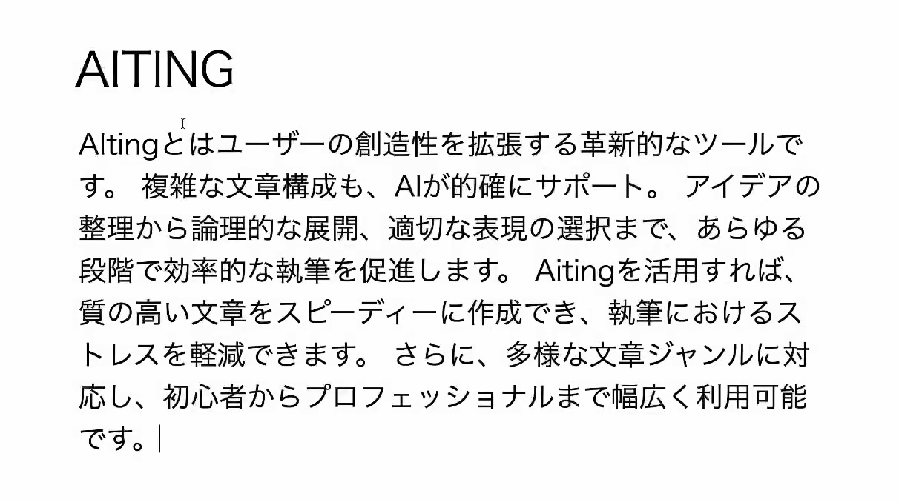

## Feature

  - たった数文字書くだけであとはAIが勝手に続きを書いてくれます
  - シンプルなUIで余計な情報をそぎ落とし、ユーザーに迷いを与えません!

## TODO - Feature

* [X] オートコンプリート
* [X] 文章のスタイル、目的をワンクリックで変えられる
* [ ] 一度作った文章の保存
* [X] いんふぃにースクロールモード ( ideaを100個生成させるときとか用にスクロールすれば無限にAIが生成する機能 )

## TODO - logic
* [ ] 文法チェッカーを`editor/hook/useEditorGrammar.js`に移す
* [ ] LLM呼び出しを`editor/hook/useEditorCoreLLM.js`に移す
* [X] コンポーネント化する
* [ ] 関数を構造化する

## TODO - Impossible
* [ ] Server Side Rendering
* [ ] Server Side Generate
* [ ] Server Components
* [ ] Advanced Routing / Nested Layouts
* [ ] Build

## よくわからないはなし

さて、一応ファイル構成や技術スタックを説明しておきます

**ファイル構造**

- `index.html`

  - このファイルは何もしませんただ
    いわゆる `static`なサイトだと.htmlではないとサイトを表示できないから使っているだけで本体は`./page/router.js`です

- `page`
  - `html`の代わりに作成された `js`が入っています
- `hook`, `components`
  - `react`に寄せてるので多分読めます
- `editor`
  - editor関連のコードです
- `test`
  - テストです `https://aiting.i32.jp/test`で実行されています

**技術スタック**

- vanilla js
- vanilla html
- vanilla css

### 与太話
「こんなものを作っているくらいだから、きっとこのリポジトリのコードも半分以上AIが書いたのだろう」と思う人もいるだろう。しかしこのリポジトリにAIが書いたコードは含まれていない。インライン系のAIサジェストも使われていない。
謎である。

なんかagentとかそういうのが出てからコード補完する系のAIが手に入りにくくなってない?
まぁエディターをころころ変えてるからってのが大きいけど
ちょっと書くとかそういうときに毎月10ドルのサブスクリプション入れんて
